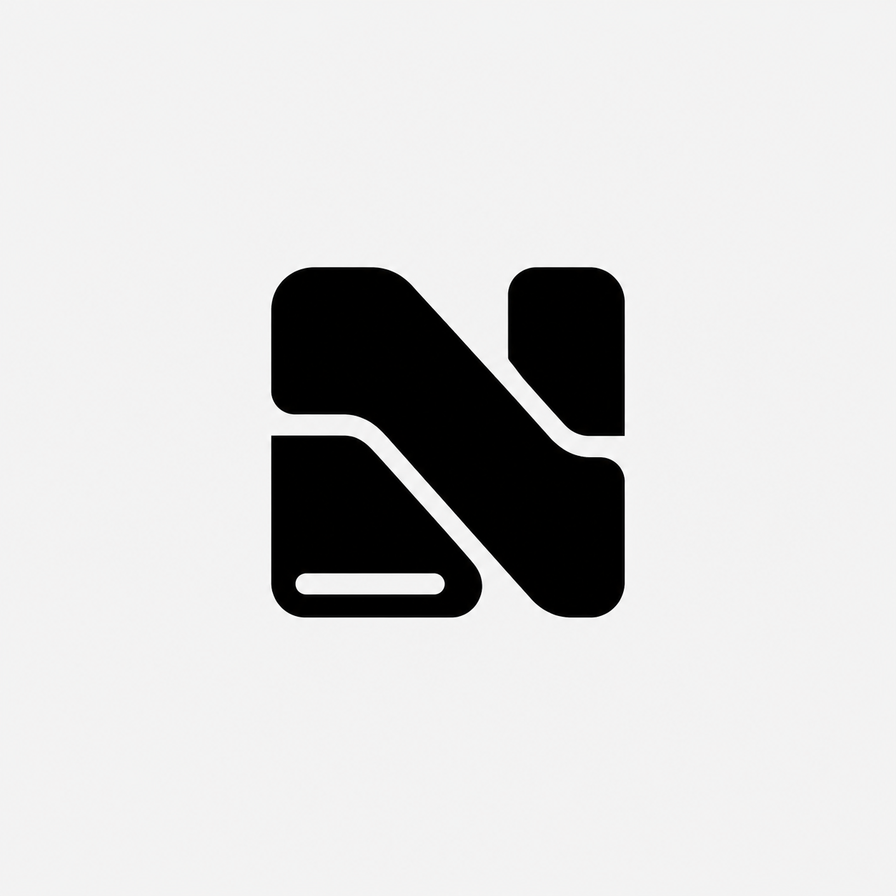
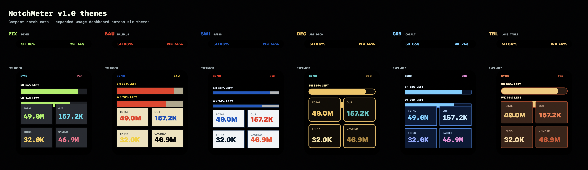

# NotchMeter



[中文说明](README.zh-CN.md)

NotchMeter is a tiny open-source macOS notch HUD for keeping coding-agent and model usage visible without leaving the workspace.

It is a good-looking coding-agent HUD that pins subscription usage to the top of your screen and tries to blend directly into the real MacBook notch. In its compact state it shows quick 5-hour and weekly quota signals; on hover, it expands into a detail panel with quota windows, reset times, provider state, and token data.

NotchMeter ships with several built-in themes and supports both Codex and Claude Code. The project is also structured so more coding agents, models, and provider backends can be added later.



## Why This Exists

On Friday, 2026-06-12, my company gave me an M-series MacBook. I decided to spend the weekend building something with it, and NotchMeter is what came out of that.

This is my first macOS app, and also the first app built on this MBP. It was almost entirely vibe-coded, so I do not pretend to understand every implementation detail. There may be unknown bugs. Contributions are very welcome.

## Status

This is an early prototype:

- macOS menu bar app: working
- notch-integrated floating HUD: working
- compact and expanded notch states: working
- theme switching: working
- provider switching: working
- local Codex token and rate-limit provider: working
- remote Codex subscription provider: experimental
- remote Claude Code subscription provider: experimental
- additional coding-agent/model providers: planned
- signed and notarized app builds: planned

## Provider Support

### Codex

Codex supports remote subscription usage through an authorization flow. That means NotchMeter can observe quota usage even if the usage happened somewhere else, such as another machine, another client, or another Codex surface.

Codex also supports local data as a fallback. It can read local Codex session files, and it can reuse the local Codex authorization cache. If you already have Codex installed and signed in, this gives you a convenient path without signing in again inside NotchMeter.

### Claude Code

Claude Code currently supports code-based authorization and remote usage fetching only. I do not personally have a Claude Code subscription, so this provider has not been tested as deeply as Codex and may need community help to smooth out the details.

## Run From Source

```sh
git clone https://github.com/ttc9082/notch-meter.git
cd notch-meter
swift run notch-meter
```

The app appears as a small top-center HUD that visually attaches to the MacBook notch area.

Hover the compact notch HUD to expand the dashboard. The panel shows quota bars, token cards, provider controls, sign-in status, theme switching, and quick `SYNC` controls. Right-click the HUD to quit.

## Build

```sh
swift build
```

## Package Locally

```sh
scripts/package-dmg.sh
```

The packaged app and DMG are written to `dist/`.

## Data Sources

By default, NotchMeter runs in `auto` mode:

```sh
NOTCHMETER_CODEX_SOURCE=auto swift run notch-meter
```

Supported values:

- `auto`: try remote subscription usage for the selected provider, otherwise read local Codex session files.
- `remote`: require remote subscription usage for the selected provider.
- `local`: only read local Codex session files.

Remote subscription usage signs in with provider-compatible OAuth flows. NotchMeter opens the browser, stores provider tokens in `~/.notchmeter/auth.json`, and refreshes tokens when needed. Codex uses a local callback. Claude Code uses Anthropic's registered HTTPS callback, so after approval you paste the authorization code back into NotchMeter. Pasting the full callback URL also works.

For advanced setups, you can pass credentials through the environment instead of the NotchMeter auth file:

```sh
export NOTCHMETER_CODEX_ACCESS_TOKEN="..."
export NOTCHMETER_CODEX_REFRESH_TOKEN="..."
# or
export NOTCHMETER_CLAUDE_ACCESS_TOKEN="..."
export NOTCHMETER_CLAUDE_REFRESH_TOKEN="..."
swift run notch-meter
```

The remote subscription endpoint is useful for accurate 5-hour and weekly quota windows. Local session files are still used as a fallback and to fill token totals when the remote response only includes quota data. If NotchMeter has no Codex credentials in `~/.notchmeter/auth.json`, it can still fall back to the existing Codex `~/.codex/auth.json` cache.

If your network needs a proxy, configure one in the app or set `NOTCHMETER_PROXY_URL`. You can also write a config file at `~/.notchmeter/config.json`:

```json
{
  "proxyURL": "http://127.0.0.1:7890"
}
```

HTTP, HTTPS, and SOCKS/SOCKS5 proxy URLs are accepted.

## What It Shows

- Current provider and sign-in state
- 5-hour and weekly quota windows when available
- Today's total, input, output, cached input, and reasoning tokens when available
- Reset timing near the quota bars
- Provider-specific details without inventing fields the provider does not return

## Privacy

In local mode, NotchMeter only reads local usage files and only extracts numeric usage fields from supported provider events. For the current Codex provider, it reads:

- `payload.info.total_token_usage`
- `payload.info.last_token_usage`
- `payload.rate_limits`

In remote provider mode, NotchMeter stores its own OAuth credentials in `~/.notchmeter/auth.json` with `0600` file permissions, or reads provider credentials from environment variables. Codex can additionally fall back to `~/.codex/auth.json`. It sends authenticated usage requests to each provider's quota endpoint and does not read, store, upload, or display prompt/response text.

## Roadmap

- Add more coding-agent and model usage providers
- Add clearer provider-specific dashboards
- Add settings for custom data directories and refresh intervals
- Add signed and notarized app builds
- Add a NotchNook-compatible widget adapter if a public widget API becomes available

## Contributing

This project is intentionally small. Good first contributions:

- improve parsing for future usage event shapes
- add provider adapters for other coding agents and model usage sources
- refine notch layout behavior across MacBook display sizes
- improve theme design and accessibility
- package signed app builds

## License

MIT
